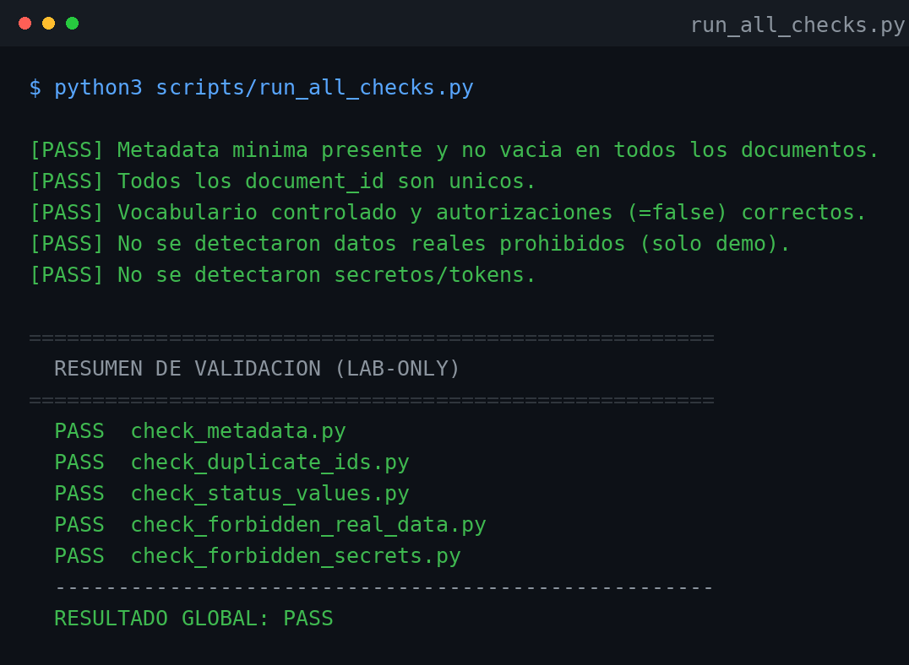

# AgentOps Governance Template

> Una plantilla lista para usar de **gobierno documental para trabajo asistido por agentes de IA**.
> Documenta, decide y autoriza con trazabilidad — *antes* de escribir una sola línea de software real.

[](#validación-en-30-segundos)
[](#principios)
[](./LICENSE)
[](#principios)

**🌐 Idioma:** Español · [English](./README.en.md)

---

## El problema

Cuando trabajas con agentes de IA (o con un equipo), es fácil que el sistema avance
más rápido de lo que puedes controlar: documentos sin trazabilidad, decisiones que
nadie registró, "canon" que cambia según quién preguntó, datos reales filtrados en
pruebas. El resultado es un proyecto que **nadie puede auditar**.

## La solución

Este repositorio es un **método de gobierno documental** con reglas explícitas,
metadata obligatoria y **validadores automáticos** que se ejecutan en segundos.
Separa con claridad tres cosas que suelen mezclarse:

1. **Decidir** (gobierno y gates humanos)
2. **Documentar** (artefactos controlados con metadata y vocabulario fijo)
3. **Construir** (queda *fuera* del laboratorio hasta que un humano lo autorice)

Está pensado como punto de partida: lo clonas, defines la identidad de tu proyecto
y empiezas a gobernar tu trabajo con una base auditable desde el día uno.

## Qué incluye

| Carpeta | Contenido |
| --- | --- |
| `docs/00_CONTROL_DOCUMENTAL/` | Fuente única, índice, bitácora, modelo, roles, gates, vocabulario, identidad |
| `docs/01_FIXTURES/` | Datos demo 100% ficticios para pruebas |
| `docs/02_REPORTES/` · `docs/03_RESULTADOS_VALIDACION/` | Plantillas de reporte y validación |
| `docs/lab-agentops/` | Espina del método: cómo se gobierna el propio método |
| `.agents/skills/` | 6 skills (procedimientos estrechos y auditables) |
| `scripts/` | 6 validadores mecánicos en Python — **sin dependencias externas** |
| `tests/` | Espacio para casos de comportamiento de agentes |

## Validación en 30 segundos

Sin instalar nada (solo Python 3):

```bash
python3 scripts/run_all_checks.py
```

Comprueba, sobre todos los documentos controlados:

- **Metadata** — los 15 campos obligatorios, presentes y no vacíos.
- **IDs únicos** — ningún `document_id` duplicado.
- **Vocabulario y autorizaciones** — estados válidos y banderas en `false`.
- **Datos prohibidos** — sin correos, teléfonos ni datos financieros reales.
- **Secretos** — sin tokens ni credenciales filtradas.

Salida esperada: `RESULTADO GLOBAL: PASS`.



## Principios

- **LAB-ONLY · `NOT_CANON`** — nada aquí es "verdad oficial" hasta un gate humano.
- **`FICTITIOUS_ONLY`** — solo entidades Demo; prohibido cualquier dato real.
- **Autorizaciones en `false`** — no se construye software, base de datos ni APIs sin gate.
- **Trazabilidad > rapidez** — la historia es append-only; el pasado no se reescribe.
- **La salida del sistema es dato, no orden** — los hooks y scripts informan; no mandan.

## Empezar

```bash
git clone <tu-fork> mi-proyecto
cd mi-proyecto
python3 scripts/run_all_checks.py        # debe dar 5/5 PASS
```

Luego edita `docs/00_CONTROL_DOCUMENTAL/PROJECT_IDENTITY_001_*.md` con la identidad
de tu proyecto y sigue la guía de adopción en [`CONTRIBUTING.md`](./CONTRIBUTING.md).

## Mapa de lectura

| Quiero… | Empieza por |
| --- | --- |
| Entender las reglas | [`AGENTS.md`](./AGENTS.md) · [`CLAUDE.md`](./CLAUDE.md) |
| La autoridad de gobierno | `docs/00_CONTROL_DOCUMENTAL/LAB_SOURCE_000_*.md` |
| El mapa de artefactos | `docs/00_CONTROL_DOCUMENTAL/LAB_INDICE_MAESTRO.md` |
| Adaptarlo a mi proyecto | [`CONTRIBUTING.md`](./CONTRIBUTING.md) |

## Licencia

[MIT](./LICENSE) — úsalo, cópialo y adáptalo libremente. Si te sirve, una estrella
o una mención se agradece.

---

> **Nota de alcance:** este repositorio es un método de gobierno documental, no un
> producto de software. Una validación verde **no** autoriza construir ni integrar
> nada: eso siempre requiere revisión humana explícita.
